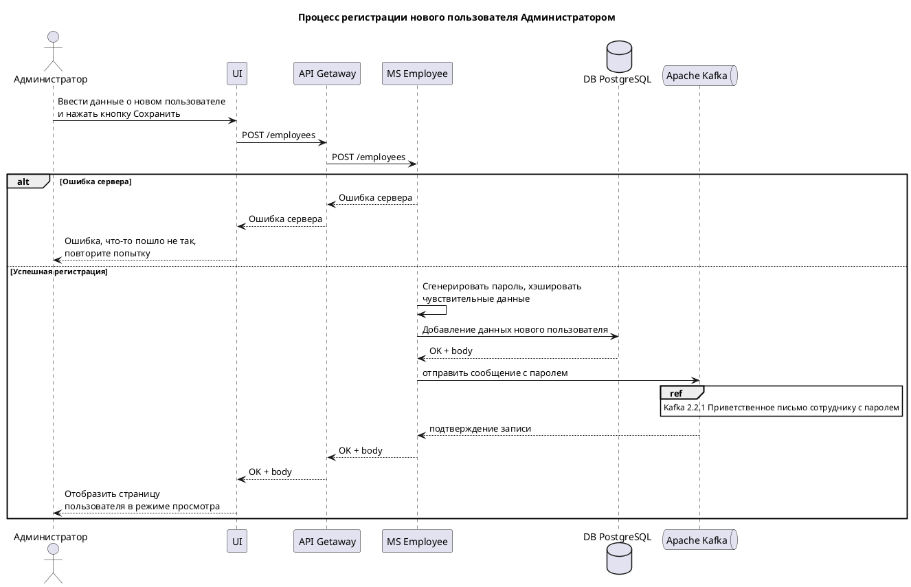

![Диаграмма]
(////www.plantuml.com/plantuml/png/ZLHDJzHG5Ds_Nt73LWOZInS6ZSGGD63GdPitzA4Dyp5EMmsxOGY80OCnhZN6Fr0gnGOwxL-uxnzvtgtDK1tG1SFhlVUTS-wvjrqAGZqCesv7XNxOCSHVxOWBUy2ftRMxX8UKVt26Xp7ECH8PPyGJBZZX0gc2kCJXqXxpJmd6Timfda-8F_8PvxWmgG4aMJW6pfNIcs5_U4CLwO2qr_LxQW2D_gO_qBsGdg-uUEGtWdFtrrVeaGdrMxqp9_S6VnGysQ3bxg3Jtp562hh1il9qgDiwC3Jty06jzuFmvT1iF7qiUQ-jNaScCe0UwCrNXbRrrhQMrBOxAQL46xNkGSnTua-SY6bZ-8EEOlGpiKUS4XTJl_9htEBqHKzynRrp5xJ7n1TohUGBkqVy3OxiEs_49-HLv8CRZO9yVMtZ6Tqsl_iB588kXnx_pa5t9oJ-OW_X-Ib8OhAxK3uI_I1Gv2vIgmQ_kLIen8D_LKPLeRZMh9qd-ywDlEL-n27aBiKt-8TWp1VpC0W9JghTS1uW9w7I7k41BYbbEfWcVmTt2Tv3vwSzcRd5zaIXozeb-8k2rF49ziWnrNCeSHXLKvid3E43W1iba7Pbu3MkrmRiPrIT8fUu6RlHGVIqsEx_twka26ZKgiMkhT8jQlUz7OK4_l0hCqDUTXEy1QwMTYJCiYvk7eKJOz_NGX2wqXoYkG0DpHRrtvXXZIMBJuiBYmjtgiz39aCTowud0eOUP1XYyJ7dN0YTSzlkyPdGOJup28K3ZKbVqlvPXOgQSzoifSAHkCBdJ5GsbhHXINCffvbPApWMHs0Jy6kRyAz-pGxi7cPxxVSjaSs2penpwTyr1eNelmA16DFp22-SMi81dzbV)

sequenceDiagram
    title Процесс регистрации нового пользователя Администратором

    actor Администратор as admin
    participant UI as ui
    participant "API Getaway" as api
    participant "MS Employee" as msE
    participant "DB PostgreSQL" as db
    participant "Apache Kafka" as kafka

    admin ->> ui: Ввести данные о новом пользователе\nи нажать кнопку Сохранить
    ui ->> api: POST /employees
    api ->> msE: POST /employees

    alt Ошибка сервера
        msE -->> api: Ошибка сервера
        api -->> ui: Ошибка сервера
        ui -->> admin: Ошибка, что-то пошло не так,\nповторите попытку
    else Успешная регистрация
        msE ->> msE: Сгенерировать пароль, хэшировать\nчувствительные данные
        msE ->> db: Добавление данных нового пользователя
        db -->> msE: OK + body
        
        msE ->> kafka: отправить сообщение с паролем
        Note over kafka: Kafka 2.2.1 Приветственное письмо сотруднику с паролем
        kafka -->> msE: подтверждение записи
        msE -->> api: OK + body
        
        api -->> ui: OK + body
        ui -->> admin: Отобразить страницу\nпользователя в режиме просмотра
    end
