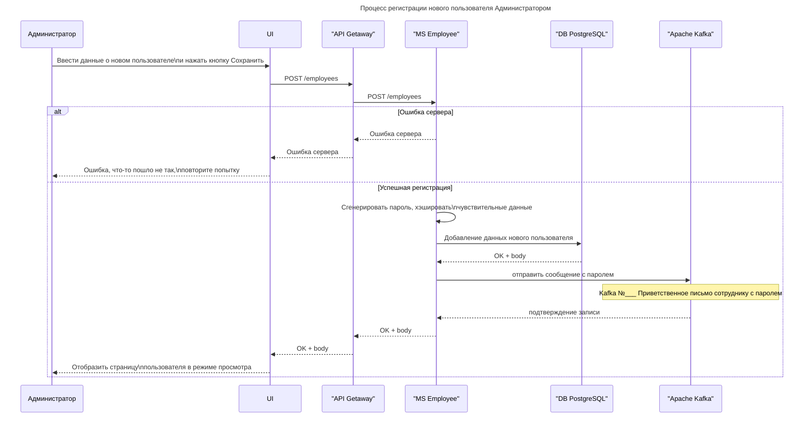

# EP №___ Регистрация сотрудника администратором

## Назначение

Данный метод позволяет авторизованному пользователю с ролью "Администратор" зарегистрировать нового пользователя.




SWAGGER

```yaml
openapi: "3.0.3"
info:
  title: Создание нового пользователя Администратором
  description: API для создания нового пользователя Администратором
  version: 1.0.0
servers:
  - url: https://host.ru/api/employees/v1.0
tags:
  - name: Admin
    description: Операции доступные для администратора

paths:
  /employees:
    post:
      tags:
        - Admin
      summary: Создание нового сотрудника
      description: Отправляет данные о новом сотруднике на сервер для создания записи.
      requestBody:
        required: true
        content:
          application/json:
            schema:
              type: object
              properties:
                firstName:
                  type: string
                middleName:
                  type: string
                lastName:
                  type: string
                birthday:
                  type: string
                  format: date
                startDate:
                  type: string
                  format: date
                positionId:
                  type: string
                  format: uuid
                email:
                  type: string
                phoneNumber:
                  type: string
                series:
                  type: string
                numberPass:
                  type: string
                issuedBy:
                  type: string
                divisionCode:
                  type: string
                registrationAddress:
                  type: string
                createPass:
                  type: string
                mainRole:
                  type: string
                  description: Идентификатор основной роли, выбираемой из списка ролей
                additionalRoles:
                  type: array
                  items:
                    type: string
                    description: Идентификаторы дополнительных ролей
              required:
                - firstName
                - lastName
                - birthday
                - startDate
                - positionId
                - email
                - phoneNumber
                - series
                - numberPass
                - issuedBy
                - divisionCode
                - registrationAddress
                - createPass
            example:
              firstName: "Иван"
              middleName: "Иванович"
              lastName: "Иванов"
              birthday: "1985-05-15"
              startDate: "2024-03-01"
              positionId: "123e4567-e89b-12d3-a456-426614174000"
              email: "ivan.ivanov@example.com"
              phoneNumber: "+7 999 123-45-67"
              series: "1234"
              numberPass: "567890"
              issuedBy: "Отдел МВД России"
              divisionCode: "123-456"
              registrationAddress: "г. Москва, ул. Примерная, д. 1"
              createPass: "2024-02-25"
              mainRole: 1
              additionalRoles: [2, 3]

      responses:
        '201':
          description: Сотрудник успешно создан
          content:
            application/json:
              schema:
                type: object
                properties:
                  status:
                    type: string
                    example: "201"
                  message:
                    type: string
                    example: "Сотрудник создан"
                  employeeId:
                    type: string
                    format: uuid
                    description: Уникальный идентификатор созданного сотрудника
              example:
                status: "201"
                message: "Сотрудник создан"
                employeeId: "550e8400-e29b-41d4-a716-446655440000"
        '400':
          description: Ошибки неверного запроса
          content:
            application/json:
              schema:
                type: object
                properties:
                  status:
                    type: string
                    example: "400"
                  message:
                    type: string
                    example: "Входной параметр отсутствует"

        '403':
          description: Операция заблокирована
          content:
            application/json:
              schema:
                type: object
                properties:
                  status:
                    type: string
                    example: "403"
                  message:
                    type: string
                    example: "Операция заблокирована"
        '500':
          description: Внутренняя ошибка сервера
          content:
            application/json:
              schema:
                type: object
                properties:
                  status:
                    type: string
                    example: "500"
                  message:
                    type: string
                    example: "Произошла внутренняя ошибка сервера"
```

### Входные параметры

| №  | Параметр              | Тип данных      | Обязательность | Источник  | Описание                          | Пример значения                  | Маппинг в БД                   |
|----|-----------------------|-----------------|----------------|-----------|-----------------------------------|-----------------------------------|--------------------------------|
| 1  | firstName             | string          | +              | Body      | Имя нового пользователя          | Иван                              | `Employee.first_name`          |
| 2  | middleName            | string          |                | Body      | Отчество                          | Иванович                         | `Employee.middle_name`         |
| 3  | lastName              | string          | +              | Body      | Фамилия                           | Иванов                           | `Employee.last_name`           |
| 4  | birthday              | string          |                | Body      | День рождения                     | 1905-05-15                       | `Employee.birthday`            |
| 5  | startDate             | string          |                | Body      | Дата начала работы                | 2025-03-01                       | `Employee.start_date`          |
| 6  | positionId            | string (UUID)   |                | Body      | Должность                         | 123e4567-e09b-12d3-6456-426614174000 | `Position.position_id`         |
| 7  | email                 | string          |                | Body      | Электронная почта                 | ivanov@example.com               | `Employee.email`               |
| 8  | phoneNumber           | string          | +              | Body      | Мобильный телефон                 | 79123456789                      | `Employee.number`              |
| 9  | series                | string          |                | Body      | Серия паспорта                    | 1234                             | `Passport.serie`               |
| 10 | numberPass            | string          |                | Body      | Номер паспорта                    | 567890                           | `Passport.number`              |
| 11 | issuedBy              | string          |                | Body      | Кем выдан паспорт                 | Отдел МВД России                 | `Passport.issued_by`           |
| 12 | divisionCode          | string          | +              | Body      | Код подразделения                 | 123-456                          | `Passport.division_code`       |
| 13 | registrationAddress   | string          |                | Body      | Адрес регистрации                 | г. Москва, ул. Примерная, д. 1   | `Passport.registration_address`|
| 14 | createDate            | string          | +              | Body      | Дата выдачи паспорта              | 2025-02-25                       | `Passport.create_date`         |
| 15 | mainRole              | string          | +              | Body      | Основная роль пользователя        | 1                                | `Role.role_id`                 |
| 16 | additionalRoles       | array[string]   |                | Body      | Дополнительные роли               | [2,3]                            | `Role.role_id`                 |


**Примечания:**
1. Для дат используется формат `YYYY-MM-DD`
2. UUID должны быть в формате `8-4-4-4-12`
3. Параметр `file` передаётся через `multipart/form-data`

**Пример входного запроса:**
```json
{
  "firstName": "Иван",
  "middleName": "Иванович",
  "lastName": "Иванов",
  "birthday": "1985-05-15",
  "startDate": "2024-03-01",
  "positionId": "123e4567-e89b-12d3-a456-426614174000",
  "email": "ivan.ivanov@example.com",
  "phoneNumber": "+7 999 123-45-67",
  "series": "1234",
  "numberPass": "567890",
  "issuedBy": "Отдел МВД России",
  "divisionCode": "123-456",
  "registrationAddress": "г. Москва, ул. Примерная, д. 1",
  "createPass": "true",
  "mainRole": 1,
  "additionalRoles": [2, 3]
}
```
**JSON Schema:**
```json
{
    "$schema": "http://json-schema.org/draft-07/schema#",
    "type": "object",
    "properties": {
        "firstName": {
        	"type": "string",
            "description": "Имя нового пользователя"
			},
     	"middleName": {
         	"type": "string",
			"description": "Отчество нового пользователя"
			},
        "lastName": {
         	"type": "string",
			"description": "Фамилия нового пользователя"
			},
        "birthday": {
         	"type": "string",
            "format": "date",
			"description": "День рождения нового пользователя"
			},
         "startDate": {
         	"type": "string",
            "format": "date",
			"description": "Дата начала работы нового пользователя"
			},
         "positionId": {
         	"type": "string",
            "format": "uuid",
			"description": "Должность нового пользователя"
			},
		"email": {
         	"type": "string",
			"description": "Электронная почта нового пользователя"
			},
		"phoneNumber": {
         	"type": "string",
			"description": "Номер телефона нового пользователя"
			},
		"series": {
         	"type": "string",
			"description": "Серия паспорта нового пользователя"
			},
		"numberPass": {
         	"type": "string",
			"description": "Номер паспорта нового пользователя"
			},
		"issuedBy": {
         	"type": "string",
			"description": "Кем выдан паспорт"
			},
		"divisionCode": {
         	"type": "string",
			"description": "Код подразделения выдавшего паспорт"
			},
		"registrationAddress": {
         	"type": "string",
			"description": "Адрес регистрации нового пользователя"
			},
		"createPass": {
         	"type": "string",
            "format": "date",
			"description": "Дата выдачи паспорта"
			},
		"mainRole": {
         	"type": "string",
			"description": "Основная роль пользователя"
			},
		"additionalRoles": {
            "type": "array",
			"items": {
				"type": "string",
				"description": "Идентификатор дополнительной роли пользователя"
				},
 			"description": "Список идентификаторов дополнительных ролей, выбираемых из списка ролей"
			},
    "required": ["firstName", "lastName", "birthday", "startDate", "positionId", "email", "phoneNumber", "series", "numberPass", "issuedBy", "divisionCode", "registrationAddress", "createPass", "mainRole"]
}
```

## Успешный ответ
**Статус:** `201 Created`

**Тело ответа:**
```json
{
    "id": "123e4567-8896-12d3-5456-426514174000"
}
```

## Параметры ответа

| № | Параметр | Тип данных | Обязательность | Описание                     | Пример значения                          | Маппинг в БД   |
|---|----------|------------|----------------|------------------------------|------------------------------------------|----------------|
| 1 | id       | string     | Обязательно    | Уникальный идентификатор UUID | `123e4567-8896-12d3-5456-426514174000`  | `Employee.id_employee`  |

## Особенности реализации
1. **Код 201** - ресурс успешно создан
2. ID генерируется системой автоматически

## Обработка ошибок

## Пример ответа при ошибке
```json
{
    "status": "400",
    "message": "Некорректный запрос. Проверьте параметры"
}
```

## Параметры ошибок

| № | Параметр | Описание           | Тип данных | Обязательность | Варианты значений                                                                 |
|---|----------|--------------------|------------|----------------|-----------------------------------------------------------------------------------|
| 1 | status   | Статус-код ответа  | string     | +              | `400` - BAD REQUEST<br>`409` - CONFLICT<br>`500` - INTERNAL SERVER ERROR          |
| 2 | message  | Описание ошибки    | string     | +              | `400`: Некорректный запрос. Проверьте параметры<br>`409`: Пользователь существует<br>`500`: Ошибка сервера |

## Особенности обработки ошибок
1. Все ошибки возвращают HTTP-статус код, соответствующий типу ошибки
2. Тело ответа всегда содержит:
   - Текстовый код статуса (аналогичный HTTP-коду)
   - Человекочитаемое описание проблемы
3. Примеры сценариев:
   - `400` - Невалидный JSON, отсутствуют обязательные поля
   - `409` - Попытка создать дубликат уникальных данных
   - `500` - Внутренние сбой БД

```sql
-- Начало транзакции
START TRANSACTION;

-- Создание переменных для ID
DECLARE @employee_id UUID;
DECLARE @account_id UUID;

-- Вставка данных в таблицу Employee
INSERT INTO Employee (
    id,
    first_name,
    middle_name,
    last_name,
    birthday,
    start_date,
    position_id,
    email,
    number,
    create_at,
    update_at,
    is_deleted
)
VALUES (
    UUID(),  -- Генерация UUID
    'Иван',  -- Имя
    'Иванович',  -- Отчество
    'Иванов',  -- Фамилия
    '1985-05-15',  -- Дата рождения
    '2024-03-01',  -- Дата начала работы
    '123e4567-e89b-12d3-a456-426614174000',  -- ID позиции
    'ivan.ivanov@example.com',  -- Исправлен пробел после точки
    '+7 999 123-45-67',  -- Номер телефона
    CURRENT_TIMESTAMP,  -- Дата создания
    CURRENT_TIMESTAMP,  -- Дата обновления
    FALSE  -- Флаг удаления
);
 
-- Получаем ID сотрудника
SET @employee_id = LASTVAL();  -- PostgreSQL эквивалент LAST_INSERT_ID()

-- Вставляем данные в таблицу Passport
INSERT INTO Passport (
  id,
  employee_id,
  series,
  number,
  issued_by,
  division_code,
  registration_address,
  create_at,
  update_at,
  is_deleted
)
VALUES (
  UUID(),
  @employee_id,
  '1234',
  '567890',
  'Отдел МВД России',
  '123-456',
  'г. Москва, ул. Примерная, д. 1',
  CURRENT_TIMESTAMP,
  CURRENT_TIMESTAMP,
  FALSE
);

-- Вставляем данные в таблицу Account
INSERT INTO Account (
  id,
  login,
  password,
  create_at,
  update_at,
  is_deleted
)
VALUES (
  UUID(),
  'ivan.ivanov@example.com',
  'bO5Uh\\fS}93C~E#',  -- сервер сгенерировал пароль
  CURRENT_TIMESTAMP,
  CURRENT_TIMESTAMP,
  FALSE
);

-- Получаем ID аккаунта
SET @account_id = LASTVAL();

-- Вставляем данные в таблицу Account_role
INSERT INTO Account_role (
  account_id,
  role_id,
  is_default,
  create_at,
  update_at,
  is_deleted
)
VALUES
  (@account_id, 1, TRUE, CURRENT_TIMESTAMP, CURRENT_TIMESTAMP, FALSE),
  (@account_id, 2, FALSE, CURRENT_TIMESTAMP, CURRENT_TIMESTAMP, FALSE),
  (@account_id, 3, FALSE, CURRENT_TIMESTAMP, CURRENT_TIMESTAMP, FALSE);

-- Вставляем данные в таблицу employee_photos (новый блок)
INSERT INTO employee_photos (
  id,
  employee_id,
  filename,
  content_type,
  photo_data,
  uploaded_at
)
VALUES (
  UUID(),
  @employee_id,
  'ivan_ivanov_photo.jpg',
  'image/jpeg',
  decode('FFD8FFE000104A46494600010101006000600000FFE1', 'hex'),  -- пример бинарных данных (обрезка)
  CURRENT_TIMESTAMP
);

-- Завершение транзакции
COMMIT;
```


