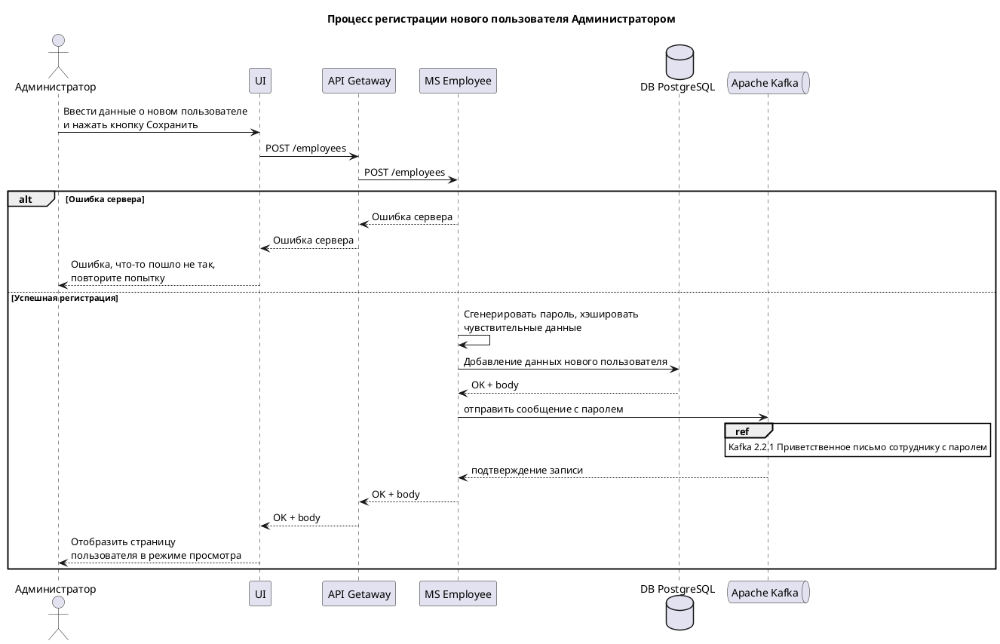

![Диаграмма]
(//www.plantuml.com/plantuml/png/ZLHFJzHG4B-_Jp7XAc3awC6WaHY21Wnwu_AMFhHXjxjkMmstPGc80OCndZN6Br0gnGQwxLUOzutylQaDLXVqmF8wCsz-VsRQnJ3ImoZkTLNaHrr3_CMEkBG7dDbTkqjuoFWxvtWOuvmWaNDEFE6IKowHAeah72xjCV-GO6B7dE7vXFW3dt612vEcWIHBXy25KdepwWzlg28TalPwVg06uEXl-WCTHFHysSLZlnMSkR-sJ8zCfD_edHcvD_YZuCawBVK6tVwECLBG2vUKfoFTqQ6XcOSFQAqVHY-6PltfOybx7VKgDh51wu7UV6beHMzjQqbjkvDIIhZHt3sGkKlyaLCnRGn_e2Y1deazueoulFAhkCOjpZO2yHNtpbtG7XDVoBMAB-mUyLSuik-y4P-GLx4FR0W5-Dhg-ZEwRNxf2nM2o3cDV-V0kniHVxQ7yFmK80dPNJ0V2Ny0A78NQQvfVdEfG8a7_wgCwq9nhLqxI_Qj6_cS-n67aBiKt-0VWWbVpC8W93YjTyDvW9o4Adk41xYabEbYclmDs1Lm3vsVzcJg5jiJ1PMDI_0N1Pd3azuZXzJCeS9XL4yDJFVjUpHkbMm4uB_7gKm_hQcvwde1MjlGW7eTO7v2YrFaKhuKxBnLRFV_xprJX6vYhIXPNQ5RrEbxEme9_E5N1egyB2vmIrojP9T0LZJ2iDAHiUyQ8WZzfXpHGXeDpHRrNvjXqqlU2bgONvY_KtyxSfdukBP2ca63J4hyF-Q2Iu5peu1fPmA7uKq150m84rqY_wpkYffpt6oemf6axi-vi6njSCkIziPUPQRjvrWSWKtetzY4VyqxU63tDeBhFtvflNRdO5Y8VYSC3A6_RW8o9l08RwDQn07Vu9y0)
